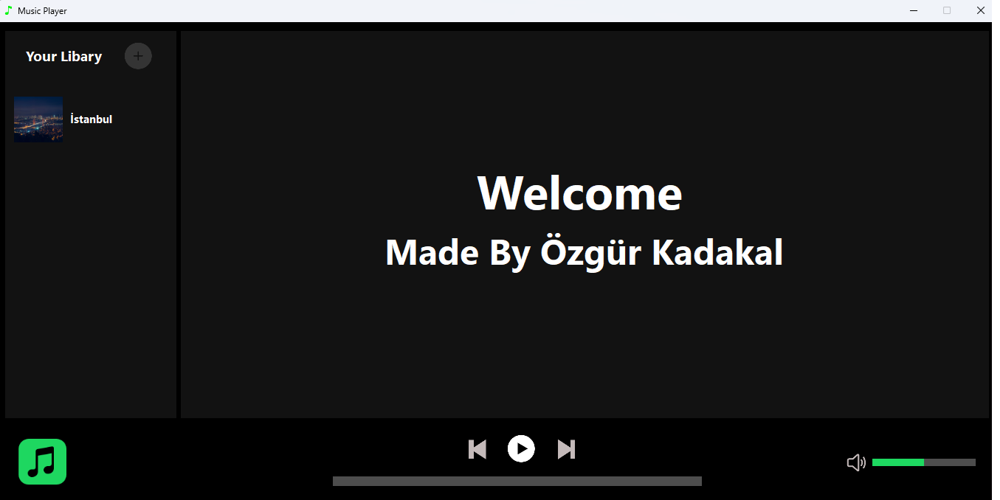
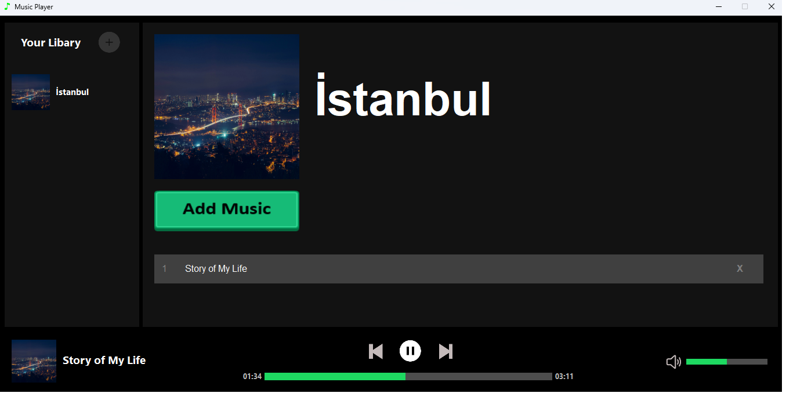
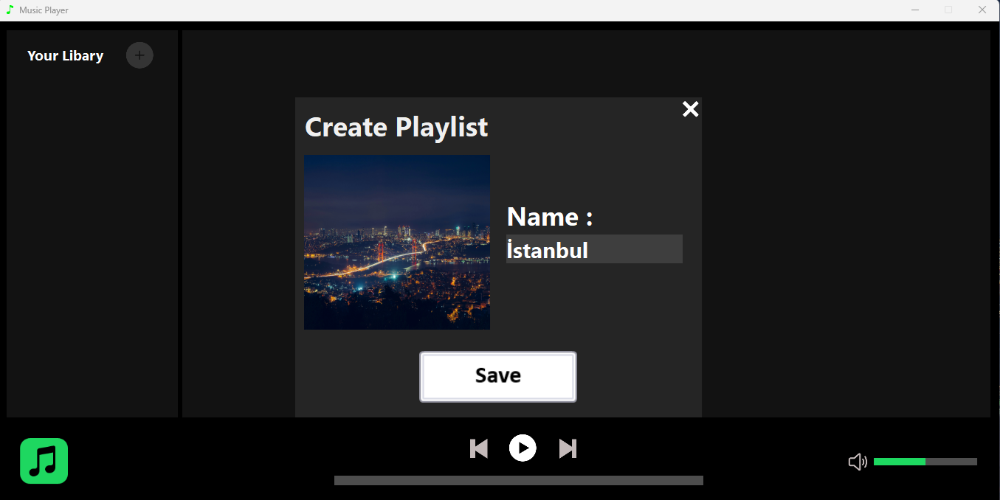
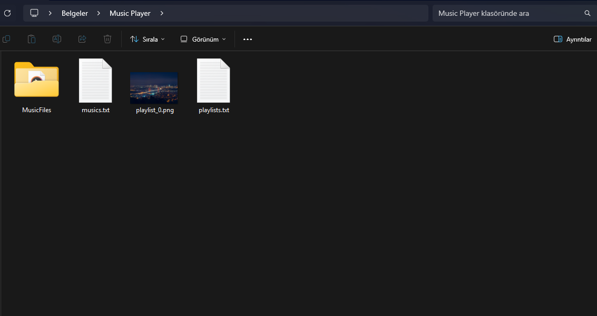

## 🌍 English

# 🎵 Music Player 🎶

### - Developed by Özgür Kadakal

**⚠️ Important:** Please extract the downloaded `.zip` file before opening the project. Otherwise, it may not work properly.

---

### 🎬 Promotion Video

📺 **Watch on YouTube:** [Music Player Demo](https://youtu.be/3Qga2CncjHE)

---

### 🖼️ Screenshots

### 🎵 Screenshot - 1

### 🎵 Screenshot - 2

### 🎵 Screenshot - 3

---

### 🎵 Music Player

Music Player is a **desktop music application** developed in C# Windows Forms by **Özgür Kadakal**.  
It allows users to create playlists, manage songs, and enjoy smooth playback controls with a modern interface.

### ✨ Features

* 📂 Add and delete playlists
* 🖼️ Add custom playlist images from computer
* 🎶 Add and remove songs from playlists
* ▶️ Play, pause, skip to next/previous song
* ⏩ Seek forward and backward
* ⏱ Display remaining time and total duration of songs
* 🔊 Volume bar with mute/unmute and click-to-adjust volume
* ✨ Hover & scaling button effects for modern UI feel
* 💾 Playlists and songs are saved permanently (they do not reset when program closes)

**Additional Notes:**

* 🤖 This project uses **AI systems**.

🧑‍💻 *This project was developed from scratch by Özgür Kadakal.*  
📌 *All code and assets are original.*

---

### 📂 File System

The program automatically creates a special folder in **My Documents** called  
`MusicPlayer` and saves all playlists and songs there.  
This ensures that your music and playlists are **not deleted when the program is closed**.

📸 **File System Example:**  

---

## 📬 Contact

For any feedback, questions, or suggestions:  
📧 [ozgurkreach@gmail.com](mailto:ozgurkreach@gmail.com)

---

## 🇹🇷 Türkçe

# 🎵 Müzik Çalar 🎶

### - Geliştirici: Özgür Kadakal

**⚠️ Önemli:** İndirdiğiniz `.zip` dosyasını ayıklayıp projeyi bu şekilde açınız. Aksi takdirde proje düzgün çalışmayabilir.

---

### 🎬 Tanıtım Videosu

📺 **YouTube'da İzle:** [Müzik Çalar Tanıtım](https://youtu.be/3Qga2CncjHE)

---

### 🖼️ Ekran Görüntüleri

### 🎵 Ekran Görüntüsü - 1 

### 🎵 Ekran Görüntüsü - 2 

### 🎵 Ekran Görüntüsü - 3 

---

### 🎵 Müzik Çalar

Müzik Çalar, **C# Windows Forms** kullanılarak **Özgür Kadakal** tarafından geliştirilmiş  
modern bir masaüstü uygulamasıdır. Kullanıcılar kendi playlistlerini oluşturabilir,  
şarkıları yönetebilir ve şık bir arayüzle müzik dinleyebilirler.

### ✨ Özellikler

* 📂 Playlist ekleme ve silme
* 🖼️ Playlistlere bilgisayardan özel resim ekleme
* 🎶 Playlistlere şarkı ekleme ve silme
* ▶️ Şarkıyı oynatma, durdurma, sonraki/önceki şarkıya geçme
* ⏩ Şarkıyı ileri/geri sarma
* ⏱ Şarkının kalan süresini ve toplam süresini gösterme
* 🔊 Ses barı: tamamen sessize alma, sesi tıklayarak ayarlama
* ✨ Hover ve buton büyüme efektleri ile modern arayüz
* 💾 Playlist ve şarkılar program kapanınca silinmez, kalıcıdır

**Ek Notlar:**

* 🤖 Bu projede **yapay zekadan faydalanılmıştır**.

🧑‍💻 *Bu proje Özgür Kadakal tarafından sıfırdan geliştirilmiştir.*  
📌 *Tüm kodlar ve içerikler özgündür.*

---

### 📂 Dosya İşlemleri

Program, kapatılıp açıldığında playlist ve şarkıların kaybolmaması için  
**Belgelerim klasöründe `MusicPlayer` adında özel bir klasör** oluşturur.  
Tüm playlist bilgileri ve şarkılar burada saklanır.  

📸 **Örnek Ekran Görüntüsü:**  

---

## 📬 İletişim

Her türlü geri bildirim, soru veya öneri için:  
📧 [ozgurkreach@gmail.com](mailto:ozgurkreach@gmail.com)
